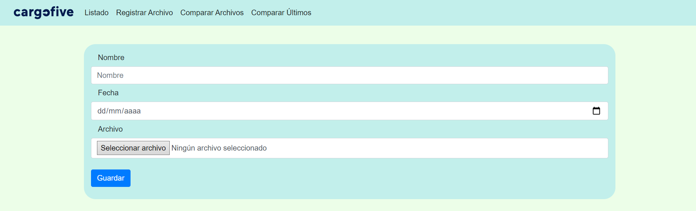
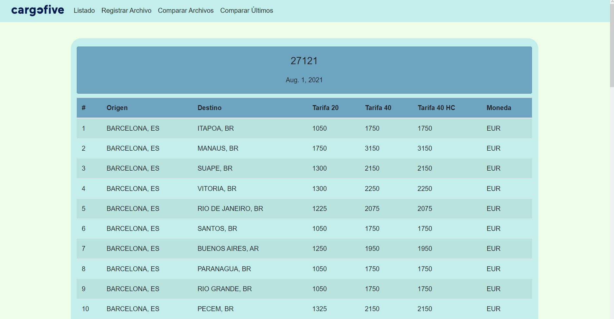
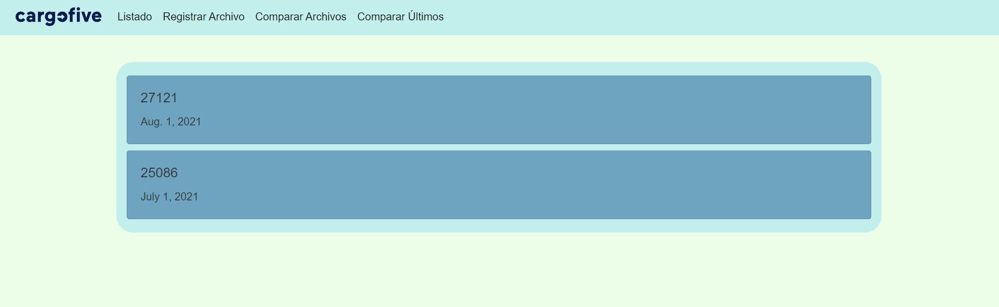
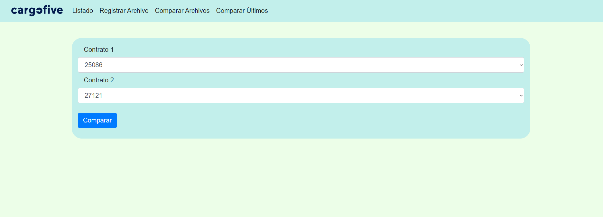
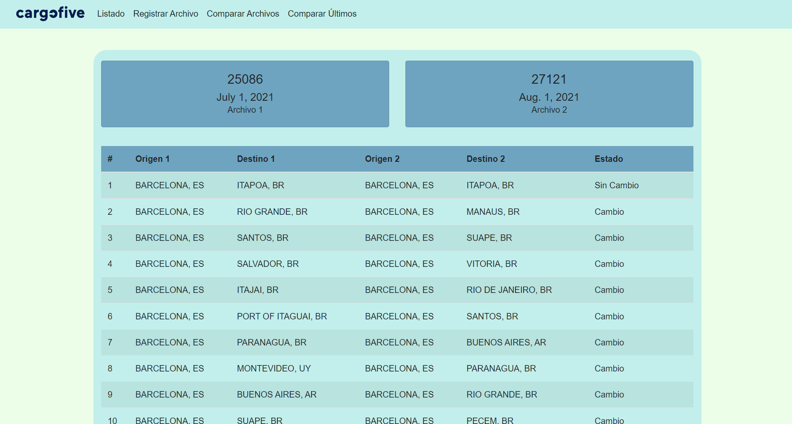
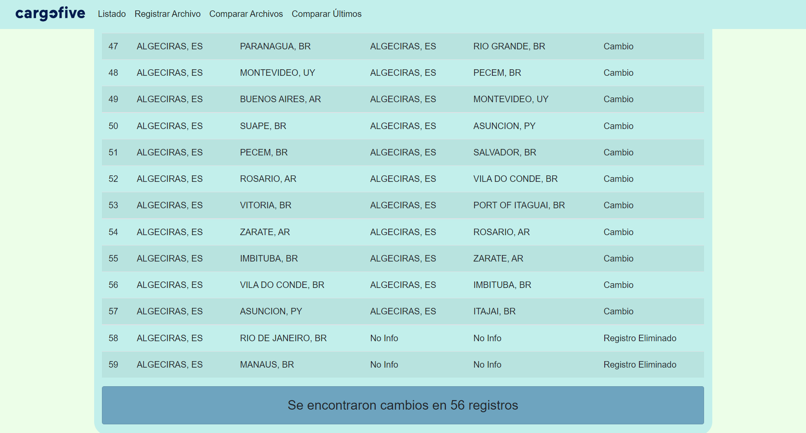

# Prueba de Cargofive

# Setup

The first thing to do is to clone the repository:

```bash
$ git clone https://github.com/EChachati/cargofive-test.git
$ cd cargofive-test
```

Create a virtual environment to install dependencies in and activate it:

```bash
$ python3 -m venv venv
$ source venv/bin/activate
```

Then install the dependencies:

```bash
(env)$ pip3 install -r requirements.txt
```

Note the `(env)` in front of the prompt. This indicates that this terminal session operates in a virtual environment

Once pip has finished downloading the dependencies do the migrations

```bash
(env)$ python3 manage.py makemigrations
(env)$ python3 manage.py migrate
```

Now you can start the server and run the project

```bash
(env)$ python3 manage.py runserver
```

And navigate to `http://127.0.0.1:8000/`

Its Done.

# Walkthrough

## File import

The user is allowed to upload container prices by route to the database via an excel file.

The user can do it by clicking `Registrar Archivo` and filling the form



Once the user do that and if the form and file are valid, it will be displayed a table with the data in the file



## List Files

The user  can see all the registered files clicking on `Listado` , and then can click in any of them to display the data as in the previous picture



## Data Analysis

 The user can either select any two files to compare (`Comparar Archivos`) or compare the last two files (`Comparar Últimos`)

If the user wants to select the file to compare he can pick them in the form and press the `Comparar` Button



In that case or comparing the last two files will display a table with both origin and destination and if there was a change



In the bottom of the page you can read the number of routes that have varied



# Deploy

This project has been deployed using Heroku on this link https://cargofive-django.herokuapp.com